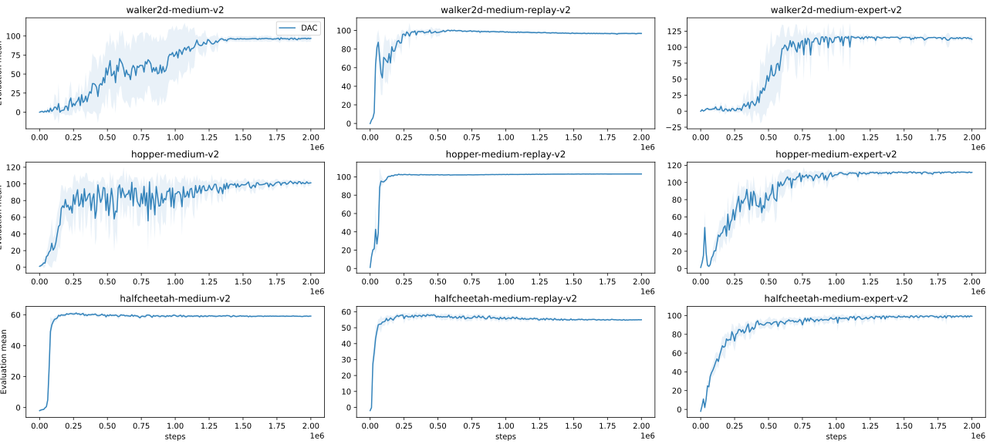
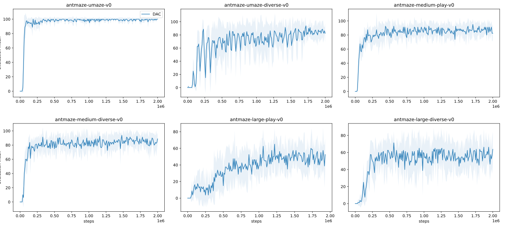

# Diffusion Actor-Critic: Formulating Constrained Policy Iteration as Diffusion Noise Regression for Offline Reinforcement Learning.

This repository is the official implementation of 
[Diffusion Actor-Critic: Formulating Constrained Policy Iteration as Diffusion Noise Regression for Offline Reinforcement Learning].
Our implementation is built upon [JAX](https://github.com/ikostrikov/jaxrl) and [jaxrl](https://github.com/ikostrikov/jaxrl). 

## Requirements

To install requirements:

```setup
pip install -r requirements.txt
```

>When running the code for the first time, it is necessary to download the [D4RL](https://github.com/digital-brain-sh/d4rl) dataset.
> As for installation of the Mujoco task environment, please refer to the [guidelines](https://ivanvoid.github.io/voidlog.github.io/2022/05/27/d4rl_installation.html).


## Training
We train our algorithm for 2 million gradient steps in order to ensure model convergence. 
For each environment, we carry out 8 independent training processes.
To train DAC using dual gradient ascent, run the code with `eta_lr > 0` and `bc_threshold > 0`. 
Here is an example for training on the `walker2d-medium-v2` dataset:

```train
python main.py --env walker2d-medium-v2 --agent dac --eta 1 --eta_lr 0.001 --bc_threshold 1 --rho 1 --q_tar lcb --num_seed 8 --gpu 0
```

If using a fixed eta, run the code with `eta_lr = 0` and `eta > 0`. 
Here is an example for the training on the `antmaze-umaze-v0` dataset:

```train
python main.py --env antmaze-umaze-v0 --agent dac --maxQ --eta 0.1 --eta_lr 0 --rho 1 --q_tar lcb --num_seed 8 --gpu 0
```

## Evaluation

The evaluation process is integrated into the training process, 
with each process evaluating performance using 10 different seeds at intervals of 10,000 gradient steps. It's optional 
to save the trained models by adding `--save_ckpt` to the code. The training and evaluation results are saved into the 'results/{env name}' folder.
To check the training statistics, you can use the tensorboard:
```
tensorboard --logdir 'results/{env name}/{results_folder}'
```
Here is an example that demonstrates the visualization of the training process after executing the code on `walker2d-medium-v2`, as shown previously:
```
tensorboard --logdir results/walker2d-medium-v2/DAC_b=1.0|QTar=lcb|rho=1.0
```

## Results

Our proposed algorithm DAC achieves the following normalized scores on [D4RL](https://github.com/digital-brain-sh/d4rl) Dataset:

| Dataset              | DAC   |
|----------------------|-------|
| halfcheetah-m        | 59.1  |
| hopper-m             | 101.2 |
| walker2d-m           | 96.8  |
| halfcheetah-m-r      | 55.0  |
| hopper-m-r           | 103.1 |
| walker2d-m-r         | 96.8  |
| halfcheetah-m-e      | 99.1  |
| hopper-m-e           | 111.7 |
| walker2d-m-e         | 113.6 |
| antmaze-u            | 99.5  |
| antmaze-u-div        | 85.0  |
| antmaze-m-play       | 85.8  |
| antmaze-m-div        | 84.0  |
| antmaze-l-play       | 50.3  |
| antmaze-l-div        | 55.3  |

Training curves:


